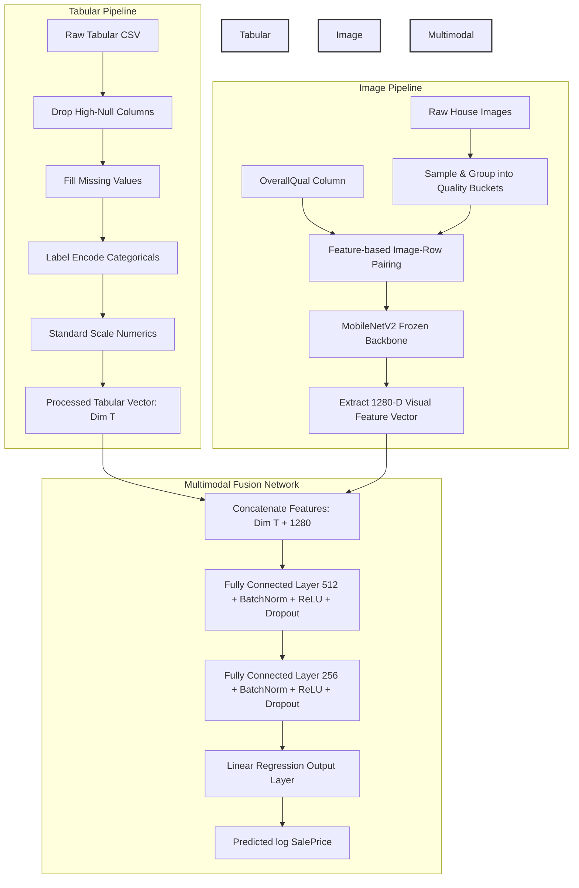

#  Multimodal House Price Prediction: Tabular + CNN Image Feature Fusion

[](https://www.python.org/)
[](https://pytorch.org/)
[](LICENSE)

An advanced multimodal regression framework that fuses structured **tabular data** (Ames Housing Dataset) with deep **visual features** (extracted via a pre-trained **MobileNetV2** backbone) to predict house sales prices. This project demonstrates how combining diverse data modalities enhances predictive performance over unimodal models.

---

##  Project Architecture

The system utilizes a dual-path pipeline to process and merge distinct data sources before feeding them into a feed-forward Multimodal Fusion Network:



---

##  Directory Structure

```directory
task 3/
├── data/
│   ├── raw/
│   │   ├── images/               # Raw house images
│   │   └── train.csv             # Raw tabular training data
│   └── processed/                # Preprocessed tabular data & scalers/encoders
├── notebooks/
│   ├── 01_eda_preprocessing.ipynb          # EDA & tabular preprocessing
│   ├── 02_image_pairing.ipynb              # Feature-based image-row pairing
│   ├── 03_cnn_feature_extraction.ipynb     # CNN feature extraction with MobileNetV2
│   └── 04_fusion_training_evaluation.ipynb # Multimodal model training & evaluation
├── outputs/
│   ├── features/                 # Extracted CNN feature arrays (.npy)
│   ├── models/                   # Saved PyTorch model checkpoints (.pth)
│   └── plots/                    # Performance evaluation plots & loss curves
├── src/
│   ├── cnn_extractor.py          # MobileNetV2 wrapper for deep feature extraction
│   ├── dataset.py                # PyTorch Multimodal Dataset & DataLoader utilities
│   ├── evaluate.py               # MAE, RMSE, R² metrics and Matplotlib plotting helpers
│   ├── image_utils.py            # Image bucketing, pairing, and loading helpers
│   ├── model.py                  # Fusion Model architecture and PyTorch train/eval loops
│   └── preprocess.py             # Tabular data clean, impute, scale, and encode pipeline
└── requirements.txt              # Project dependency requirements
```

---

##  Prerequisites & Setup

### 1. Environment Installation
Ensure you have Python 3.8+ installed. You can install all required dependencies by running:

```bash
pip install -r requirements.txt
```

### 2. Dependencies Overview
* **PyTorch & Torchvision**: For MobileNetV2 backbone, neural network design, training, and GPU-acceleration support.
* **Scikit-Learn**: For preprocessing (StandardScaler, LabelEncoder) and evaluation metrics (R², MAE, RMSE).
* **Pandas & NumPy**: For high-performance data manipulation and numerical arrays.
* **Matplotlib & Seaborn**: For rich visual plots (actual vs. predicted house prices, residuals, and loss curves).
* **Pillow & OpenCV**: For robust image loading, resizing, and processing.
* **TQDM**: Interactive progress bars for feature extraction and training.

---

##  Step-by-Step Workflow

The pipeline is organized into **4 sequential notebooks** which guide you through the process from raw data to a fully-trained multimodal network:

### Step 1: Exploratory Data Analysis & Preprocessing
* **File**: `notebooks/01_eda_preprocessing.ipynb`
* **Task**: Reads raw tabular features, handles high-null features (>40% missing threshold), performs median imputation for numerics, handles categoricals via mode/unknown class imputation, applies `LabelEncoder` to categories, and standardizes numeric columns.

### Step 2: Feature-Based Image Pairing
* **File**: `notebooks/02_image_pairing.ipynb`
* **Task**: Pairs house images with corresponding rows based on tabular house quality (`OverallQual`). Images are sampled and grouped into quality buckets (1-10) to map realistic visual aesthetics to numeric labels.

### Step 3: Deep Feature Extraction (CNN)
* **File**: `notebooks/03_cnn_feature_extraction.ipynb`
* **Task**: Uses a pre-trained **MobileNetV2** backbone to extract deep convolutional representations. The backbone is frozen (excluding the final classifier) to serve as a fast and lightweight feature extractor, outputting **1280-dimensional vectors** for each image.

### Step 4: Multimodal Fusion Training & Evaluation
* **File**: `notebooks/04_fusion_training_evaluation.ipynb`
* **Task**: Concatenates tabular features with 1280-D visual embeddings. Trains a `FusionModel` (MLP head) to regress the house `SalePrice` on a log scale (for scale stability). Performs training and generates validation loss curves, residual analyses, and metrics reports.

---

##  Modular Codebase (`src/`)

For production deployment and clean code architecture, all core logic is modularized inside the `src/` directory:

*  **`preprocess.py`**: A clean, scalable tabular pipeline. Handles numeric/categorical detection, missing values, column dropping, target scaling, and object saving (`scaler.pkl`, `encoders.pkl`).
*  **`image_utils.py`**: Gathers and sorts image paths. Computes bucket boundaries based on `OverallQual` and outputs a repeatable mapping DataFrame.
*  **`cnn_extractor.py`**: Initializes the pretrained network on the configured device (fully compatible with **CUDA** or **CPU**), wraps images in a DataLoader, and runs rapid batch feature extraction.
*  **`dataset.py`**: Custom PyTorch `MultimodalDataset` that synchronizes tabular matrices, CNN arrays, and log targets, returning structured tuples.
*  **`model.py`**: Defines the `FusionModel` neural network with custom **Kaiming Normal (He)** initialization, a robust training loop with gradient clipping, and checkpoint saving.
*  **`evaluate.py`**: Computes evaluation statistics (Log MAE/RMSE, USD-scaled MAE/RMSE, and $R^2$). Generates actual vs. predicted scatters, trendlines, residual analysis plots, and loss curves.

---

##  Evaluation & Results

All models save visual outcomes to the `outputs/plots/` directory, including:
1. **Loss Curves**: Highlighting training vs. validation loss (MSE) and identifying the optimal early-stopping checkpoint.
2. **Actual vs. Predicted Price Scatter**: Includes target regression line, line of perfect fit, $R^2$ score, and MAE annotations.
3. **Residual Distribution**: Illustrates regression residuals (Predicted - Actual) plotted against real values to check for constant variance (homoscedasticity).

---

##  License

This project is licensed under the MIT License - see the LICENSE file for details.
